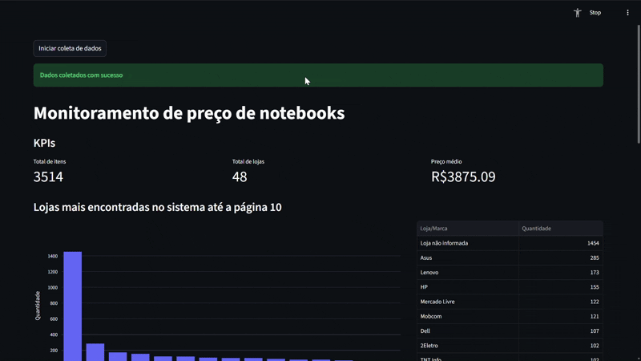

# 📈 Monitoramento de Preços de Notebooks 
Este projeto é uma ferramenta poderosa RPA para monitoramento de preços de produtos. Ele é composto por três partes principais:

🤖 Coleta de Dados: Esta parte é responsável por coletar dados de preços de notebooks de uma página específica do Mercado Livre.

🧹 Transformação de Dados: Esta parte é responsável por transformar os dados coletados em um formato mais adequado para análise. O arquivo transform/main.py é responsável por realizar as transformações necessárias nos dados.

📊 Visualização de Dados: Esta parte é responsável por exibir os dados transformados de forma visual. O arquivo view/main.py é responsável por criar uma interface de usuário usando o Streamlit, onde os dados são exibidos em gráficos e tabelas.

## 🚀 Tecnologias 
**Python**: Linguagem para execução do projeto 

**Scrapy**: Web Scraping para extração de dados

**Pandas**: Limpeza e transformação de dados 

**Streamlit**: Dashboard de dados

## 📊📈 Gif da Dashboard

  

## 📦Rodar o projeto
Para executar o projeto, siga os seguintes passos:

Certifique-se de ter o Python instalado em sua máquina

https://www.python.org/downloads/

Clone este repositório para o seu computador.

**git clone https://github.com/VinicyosFerreira/price_monitor**

Instale as dependências do projeto.

**pip install -r requirements.txt**

Coleta de dados via scrapy na pasta (src/collect).Será gerado a pasta data com arquivo JSON.

**scrapy crawl MercadoLivre -o ../../data/products.jsonl**

Limpeza e transformação de dados na pasta(src/transform).Será gerado na pasta data um csv com dados.

**python main.py**

Execução do dashboard na pasta (src/view)

**streamlit run main.py**

## 🔗 Links 
**Código Fonte**

https://github.com/VinicyosFerreira/price_monitor
